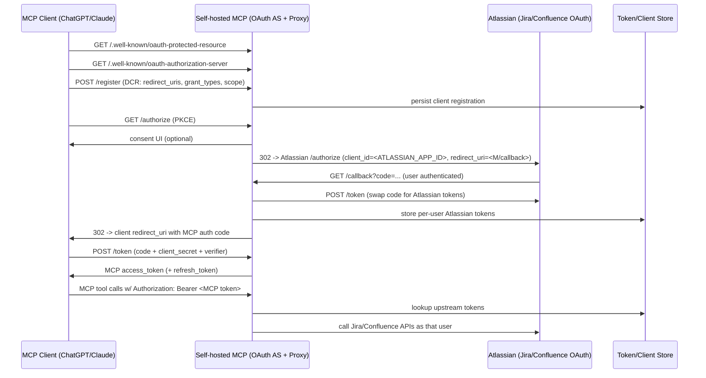

# MCP-atlassian

This is a fork of [sooperset/mcp-atlassian](https://github.com/sooperset/mcp-atlassian), with a couple of features added:

- Upgrade FastMCP (security + API changes, incl. support for [OAuth Proxy](https://gofastmcp.com/servers/auth/oauth-proxy) and [Storage Backends](https://gofastmcp.com/servers/storage-backends) based on [py-key-value-aio](https://github.com/strawgate/py-key-value)) and refactor request context handling so auth state can be resolved per request/user.
- Add an OAuth Proxy layer that:
    - exposes `/.well-known/oauth-protected-resource` + `/.well-known/oauth-authorization-server` as per [MCP AuthZ/AuthN spec](https://modelcontextprotocol.io/specification/2025-11-25/basic/authorization)
    - implements POST /register (Dynamic Client Registration)
    - implements GET /authorize (PKCE auth code flow + user consent)
    - implements POST /token (code + refresh exchange for MCP access tokens)
    - implements GET /callback (upstream Atlassian redirect target)
- Add a custom [Storage Backend](https://gofastmcp.com/servers/storage-backends) using NATS JetStream KV for:
    - DCR client registrations (`client_id`/`client_secret`, `redirect_uri`s, etc)
    - per-user upstream tokens (Atlassian access/refresh tokens), keyed by our “subject”
    - In-memory for local dev + a persistent KV backend (JetStream/NATS KV implementation of [py-key-value](https://github.com/strawgate/py-key-value) for storing _encrypted_ user tokens.
- Implement the token swap / bridging:
    - On callback, exchange Atlassian code at Atlassian token endpoint
    - Store upstream token set
    - Issue our own MCP access/refresh token back to the MCP client
    - On tool calls, verify our token → load upstream token → call Jira/Confluence
- OpenTelemetry tracing (OTLP/HTTP) + Cilium NetworkPolicy config so we can derive minimal egress allow-lists before Drive enforces network policies.

